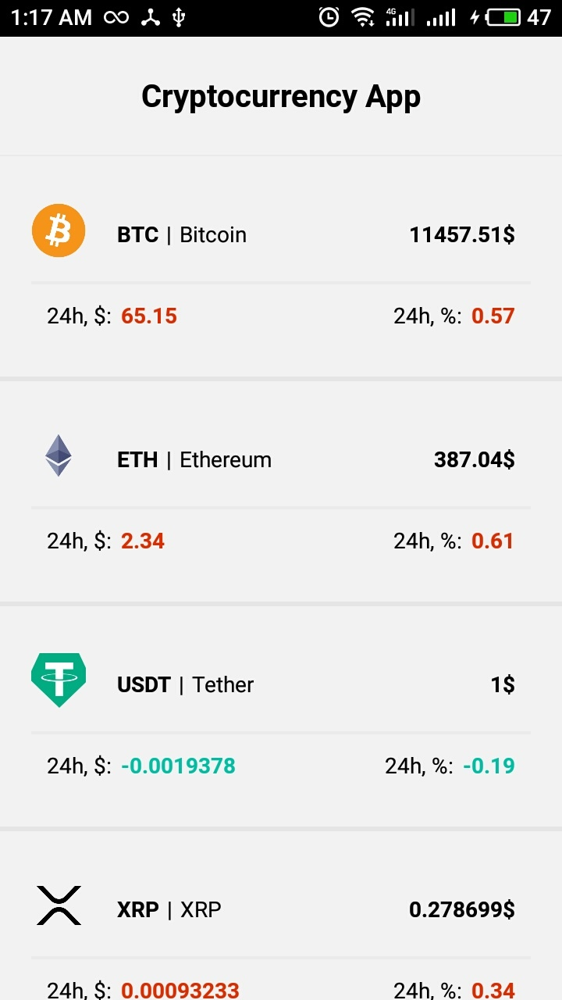
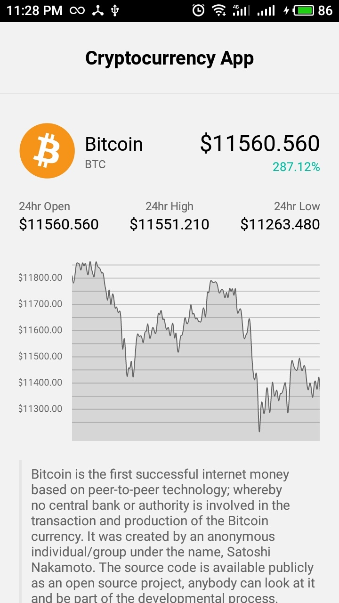

# react-native-crypto-app
💵 Application for checking the rate of cryptocurrencies using React Native + Redux + Redux Thunk + ReactNavigation + TypeScript (in progress)

## Project setup
```
npm install
```

### Compiles and hot-reloads for development
```
npm run start
```

## Images
Screenshots aren't exactly correct due to "night light" enabled; I'll fix it later;

<div style="display: flex; margin: 20px 0">
  

  
</div>
